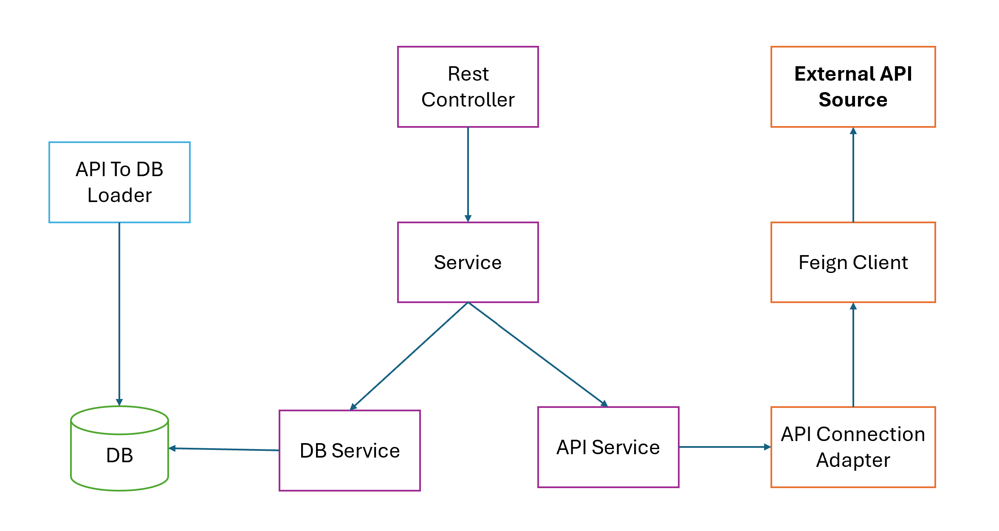

**Application Design + Layers**

* **Controller** : Rest controller responsible for providing the API to get the standings.
* **Controller Advice** : Handles exceptions and provides custom error messages, status codes and responses
* **Input Validator** : Validates the alphanumeric character and space. Else throws an error
* **Service Interface** : Interface contains methods to get standings and competitions required to get the standings from the API provided
* **API service implementation** : Implementation of service interface inorder to get the data from the source API through APIConnectionAdapter and filter the data based on the params shared via exposed rest endpoints
* **DB Service Implementation** : Implementation of service interface inorder to get the data from the Database through Spring JPA with filters the data based on the params shared via exposed rest endpoints
* **API Connection Adapter** : Which connects to the API using feign client (Rest client for the source API)
* **Football API Feign Client** : This is the rest client which connects to the source API in order to maintain single source of API Client
* **API Data to Database Loader** : This is a class enabled scheduling, loads all the Competitions and Standings for each standing into our local Database. Currently, it's configured to run every hour.

**Local Setup**

* **Prerequisite**
  1. Java 21
  2. Docker
  3. IDE supports Java 21
  4. Internet Connectivity (For DockerHub)

* **Run Locally** : 
  1. mvn clean install
  2. Start the application in Spring boot way

**Project Contains**
1. API Implementation
2. JUnits (Mostly functional scenarios)
3. Local setup with docker
4. Swagger Addition (OpenAPI)
5. README.md
6. Production Ready Env

**Important Details**

*Rest Endpoint* : *GET* : *http://localhost:8080/football/standings?league_name=xxxx&country_name=yyyy&team_name=zzzz*

*Swagger Endpoint* : *http://localhost:8080/football/swagger-ui/index.html#/football-standings-controller/getStandings*